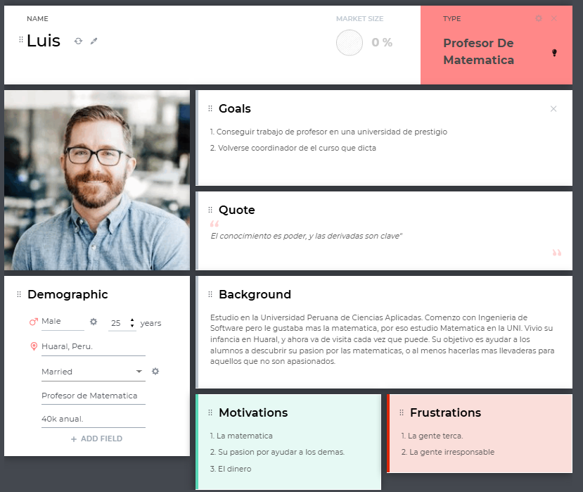
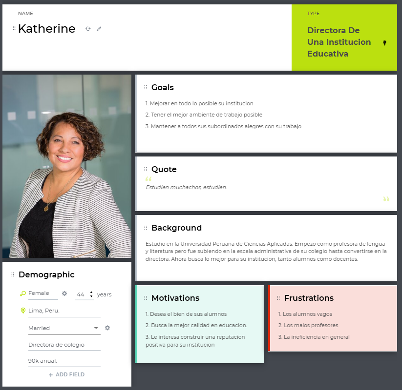
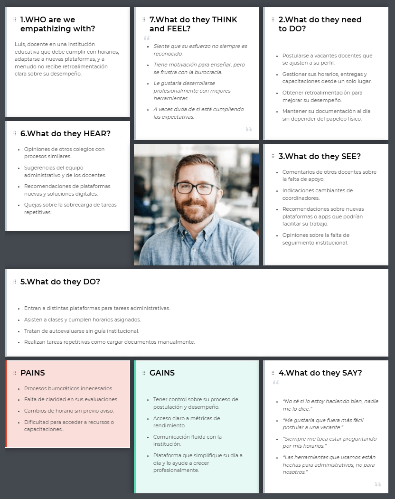
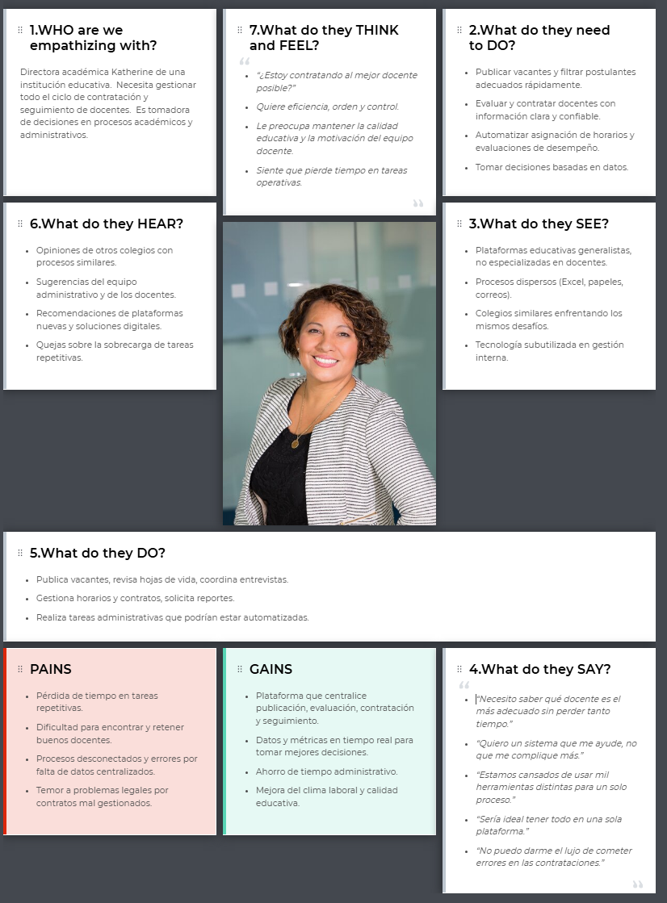
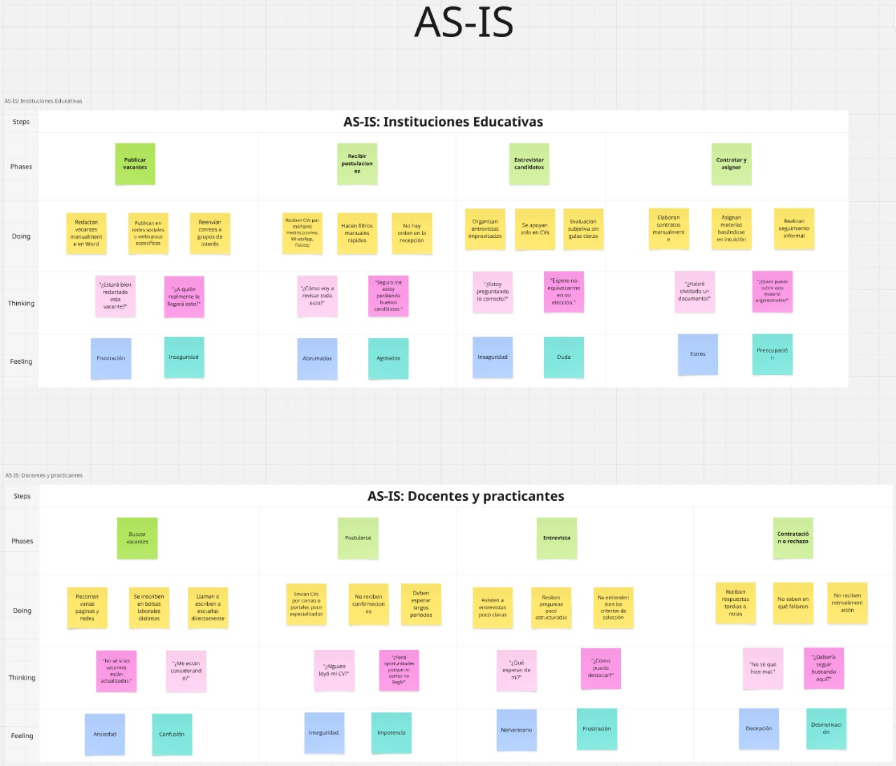

# Capítulo II: Requirements Elicitation & Analysis

## 2.1. Competidores

<table style="width: 100%; border-collapse: collapse; font-family: Arial, sans-serif;">
        <tr>
            <td colspan="6" style="border: 1px solid black; padding: 8px; vertical-align: top; "><strong>Competitive Analysis Landscape</strong></td>
        </tr>
        <tr>
            <td style="border: 1px solid black; padding: 8px; vertical-align: top;"><strong>¿Por qué llevar a cabo este análisis?</strong></td>
            <td colspan="5" style="border: 1px solid black; padding: 8px; vertical-align: top;">
                Comprender cómo se diferencia TeachMatch de sus principales competidores, identificar oportunidades de mejora y validar nuestra ventaja competitiva para optimizar la estrategia de producto y comercialización.
            </td>
        </tr>
        <tr>
            <td colspan="2" style="border: 1px solid black; padding: 8px; vertical-align: top;">Marca y Logo</td>
            <td style="border: 1px solid black; padding: 8px; vertical-align: top;"><strong>TeachMatch</strong> </td>
            <td style="border: 1px solid black; padding: 8px; vertical-align: top;"><strong>Edutalent</strong> </td>
            <td style="border: 1px solid black; padding: 8px; vertical-align: top;"><strong>Worky</strong> </td>
            <td style="border: 1px solid black; padding: 8px; vertical-align: top;"><strong>Talent.com</strong> </td>
        </tr>
        <tr>
            <td rowspan="2" style="border: 1px solid black; padding: 8px; vertical-align: top; width: 15%;"><strong>Perfil</strong></td>
            <td style="border: 1px solid black; padding: 8px; vertical-align: top;"><strong>Overview</strong></td>
            <td style="border: 1px solid black; padding: 8px; vertical-align: top;">
                Plataforma web que optimiza la contratación, evaluación y seguimiento de docentes en instituciones educativas.
            </td>
            <td style="border: 1px solid black; padding: 8px; vertical-align: top;">
                Plataforma latinoamericana enfocada en reclutamiento y formación de talento educativo.
            </td>
            <td style="border: 1px solid black; padding: 8px; vertical-align: top;">
                Herramienta general de gestión de talento, utilizada también por escuelas.
            </td>
            <td style="border: 1px solid black; padding: 8px; vertical-align: top;">
                Portal de empleo global con categoría específica para educación, que conecta vacantes con docentes.
            </td>
        </tr>
        <tr>
            <td style="border: 1px solid black; padding: 8px; vertical-align: top;"><strong>Ventaja competitiva</strong> ¿Qué valor ofrece a los clientes?</td>
            <td style="border: 1px solid black; padding: 8px; vertical-align: top;">
                <ul style="margin:0 0 0 16px; padding:0;">
                    <li>Flujo integral de contratación hasta el desempeño.</li>
                    <li>Pruebas automatizadas.</li>
                    <li>Horarios.</li>
                    <li>Seguimiento.</li>
                </ul>
            </td>
            <td style="border: 1px solid black; padding: 8px; vertical-align: top;">
                <ul style="margin:0 0 0 16px; padding:0;">
                    <li>Foco en talento educativo.</li>
                    <li>Evaluaciones previas.</li>
                    <li>Acceso a formaciones.</li>
                </ul>
            </td>
            <td style="border: 1px solid black; padding: 8px; vertical-align: top;">
                <ul style="margin:0 0 0 16px; padding:0;">
                    <li>Automatización general en RR.HH..</li>
                    <li>Interfaz intuitiva.</li>
                </ul>
            </td>
            <td style="border: 1px solid black; padding: 8px; vertical-align: top;">
                <ul style="margin:0 0 0 16px; padding:0;">
                    <li>Alta visibilidad de vacantes.</li>
                    <li>Amplia base de usuarios.</li>
                    <li>Segmentación por país y área académica.</li>
                </ul>
            </td>
        </tr>
        <tr>
            <td rowspan="2" style="border: 1px solid black; padding: 8px; vertical-align: top; width: 15%;"><strong>Perfil de Marketing</strong></td>
            <td style="border: 1px solid black; padding: 8px; vertical-align: top;"><strong>Mercado objetivo</strong></td>
            <td style="border: 1px solid black; padding: 8px; vertical-align: top;">
                Instituciones educativas, departamentos de RR.HH. académicos y docentes aspirantes.
            </td>
            <td style="border: 1px solid black; padding: 8px; vertical-align: top;">
                Escuelas y universidades en Latinoamérica.
            </td>
            <td style="border: 1px solid black; padding: 8px; vertical-align: top;">
                Empresas de múltiples sectores, incluyendo algunas escuelas privadas.
            </td>
            <td style="border: 1px solid black; padding: 8px; vertical-align: top;">
                Docentes en búsqueda de empleo y escuelas que buscan visibilidad para sus ofertas laborales.
            </td>
        </tr>
        <tr>
            <td style="border: 1px solid black; padding: 8px; vertical-align: top;"><strong>Estrategias de marketing</strong></td>
            <td style="border: 1px solid black; padding: 8px; vertical-align: top;">
                <ul style="margin:0 0 0 16px; padding:0;">
                    <li>Alianzas institucionales.</li>
                    <li>Presencia en ferias educativas.</li>
                    <li>Inbound marketing con contenido especializado.</li>
                </ul>
            </td>
            <td style="border: 1px solid black; padding: 8px; vertical-align: top;">
                <ul style="margin:0 0 0 16px; padding:0;">
                    <li>Promoción en redes educativas.</li>
                    <li>Webinars y participación en eventos de educación.</li>
                </ul>
            </td>
            <td style="border: 1px solid black; padding: 8px; vertical-align: top;">
                Marketing digital y posicionamiento como software de RR.HH. eficiente.
            </td>
            <td style="border: 1px solid black; padding: 8px; vertical-align: top;">
                <ul style="margin:0 0 0 16px; padding:0;">
                    <li>Publicidad en motores de búsqueda.</li>
                    <li>Redes sociales.</li>
                    <li>Convenios con universidades.</li>
                </ul>
            </td>
        </tr>
        <tr>
            <td rowspan="3" style="border: 1px solid black; padding: 8px; vertical-align: top; width: 15%;"><strong>Perfil de Producto</strong></td>
            <td style="border: 1px solid black; padding: 8px; vertical-align: top;"><strong>Productos & Servicios</strong></td>
            <td style="border: 1px solid black; padding: 8px; vertical-align: top;">
                <ul style="margin:0 0 0 16px; padding:0;">
                    <li>Publicación de vacantes.</li>
                    <li>Evaluación psicopedagógica.</li>
                    <li>Gestión de contratos.</li>
                    <li>Horarios y desempeño.</li>
                </ul>
            </td>
            <td style="border: 1px solid black; padding: 8px; vertical-align: top;">
                <ul style="margin:0 0 0 16px; padding:0;">
                    <li>Plataforma de vacantes.</li>
                    <li>Cursos Online.</li>
                    <li>Tests de compatibilidad.</li>
                    <li>Horarios y desempeño.</li>
                </ul>
            </td>
            <td style="border: 1px solid black; padding: 8px; vertical-align: top;">
                <ul style="margin:0 0 0 16px; padding:0;">
                    <li>Módulos de contratación.</li>
                    <li>Control documental.</li>
                    <li>Desempeño y nómina.</li>
                    <li>Horarios y desempeño.</li>
                </ul>
            </td>
            <td style="border: 1px solid black; padding: 8px; vertical-align: top;">
                <ul style="margin:0 0 0 16px; padding:0;">
                    <li>Motor de búsqueda de empleo por categoría.</li>
                    <li>Alertas de vacantes.</li>
                    <li>Opción de publicación paga por instituciones.</li>
                </ul>
            </td>
        </tr>
        <tr>
            <td style="border: 1px solid black; padding: 8px; vertical-align: top;"><strong>Precios & Costos</strong></td>
            <td style="border: 1px solid black; padding: 8px; vertical-align: top;">Freemium para instituciones pequeñas; licencias escalables por número de docentes o sedes.</td>
            <td style="border: 1px solid black; padding: 8px; vertical-align: top;">Planes por institución; algunos servicios con costo adicional.</td>
            <td style="border: 1px solid black; padding: 8px; vertical-align: top;">Modelo SaaS con precios según tamaño de empresa.</td>
            <td style="border: 1px solid black; padding: 8px; vertical-align: top;">Publicación gratuita con opción premium para destacar vacantes.</td>
        </tr>
        <tr>
            <td style="border: 1px solid black; padding: 8px; vertical-align: top;"><strong>Canales de distribución</strong> (Web y/o Móvil)</td>
            <td style="border: 1px solid black; padding: 8px; vertical-align: top;">Web y movil. Integración con calendarios y herramientas educativas</td>
            <td style="border: 1px solid black; padding: 8px; vertical-align: top;">Web y movil.</td>
            <td style="border: 1px solid black; padding: 8px; vertical-align: top;">Web y movil..</td>
            <td style="border: 1px solid black; padding: 8px; vertical-align: top;">Web y movil.</td>
        </tr>
        <tr>
            <td rowspan="4" style="border: 1px solid black; padding: 8px; vertical-align: top; width: 15%;"><strong>Análisis SWOT</strong></td>
            <td style="border: 1px solid black; padding: 8px; vertical-align: top;"><strong>Fortalezas</strong></td>
            <td style="border: 1px solid black; padding: 8px; vertical-align: top;">
                <ul style="margin:0 0 0 16px; padding:0;">
                    <li>Especialización 100% en el ámbito educativo. Flujo completo desde la vacante hasta la evaluación de desempeño.</li>
                    <li>Evaluaciones pedagógicas y psicométricas integradas. Interfaz intuitiva, multirrol y adaptable al contexto escolar.</li>
                </ul>
            </td>
            <td style="border: 1px solid black; padding: 8px; vertical-align: top;">
                    <ul style="margin:0 0 0 16px; padding:0;">
                    <li>Foco exclusivo en talento educativo. Plataforma conocida en algunos países de Latinoamérica.</li>
                    <li>Evaluaciones y cursos formativos integrados. Base de datos de docentes activos.</li>
                </ul>
            </td>
            <td style="border: 1px solid black; padding: 8px; vertical-align: top;">
                    <ul style="margin:0 0 0 16px; padding:0;">
                    <li>Plataforma SaaS establecida con buena interfaz. Automatización de procesos de RR.HH. y documentación.</li>
                    <li>Aplicable a múltiples sectores, incluyendo educación.</li>
                </ul>        
            </td>
            <td style="border: 1px solid black; padding: 8px; vertical-align: top;">
                    <ul style="margin:0 0 0 16px; padding:0;">
                    <li>Gran base de usuarios y visibilidad global. Posicionamiento SEO y segmentación por sector, país y puesto.</li>
                    <li>Modelo de publicación simple y escalable.</li>
                </ul>
            </td>
        </tr>
        <tr>
            <td style="border: 1px solid black; padding: 8px; vertical-align: top;"><strong>Debilidades</strong></td>
            <td style="border: 1px solid black; padding: 8px; vertical-align: top;">
                Baja notoriedad de marca frente a grandes plataformas. Requiere alianzas para ampliar su base institucional.
            </td>
            <td style="border: 1px solid black; padding: 8px; vertical-align: top;">
                    <ul style="margin:0 0 0 16px; padding:0;">
                    <li>Poca integración con procesos como horarios, contratos y seguimiento post-contratación.</li>
                    <li>Limitada cobertura fuera de Latinoamérica.</li>
                </ul>
            </td>
            <td style="border: 1px solid black; padding: 8px; vertical-align: top;">
                    <ul style="margin:0 0 0 16px; padding:0;">
                    <li>No está diseñada específicamente para educación. Carece de módulos pedagógicos, académicos o de seguimiento docente.</li>
                    <li>Poca personalización en cuanto a procesos educativos.</li>
                </ul>
            </td>
            <td style="border: 1px solid black; padding: 8px; vertical-align: top;">
                    <ul style="margin:0 0 0 16px; padding:0;">
                    <li>No ofrece herramientas para evaluación ni seguimiento. No hay conexión directa con procesos escolares internos.</li>
                    <li>Solo conecta vacantes, sin gestión posterior al reclutamiento.</li>
                </ul>
            </td>
        </tr>
        <tr>
            <td style="border: 1px solid black; padding: 8px; vertical-align: top;"><strong>Oportunidades</strong></td>
            <td style="border: 1px solid black; padding: 8px; vertical-align: top;">
                <ul style="margin:0 0 0 16px; padding:0;">
                    <li>Creciente digitalización en escuelas y universidades. Posibilidad de convertirse en referente en gestión docente.</li>
                    <li>Falta de competencia directa con flujo tan integral como el de TeachMatch.</li>
                </ul>
            </td>
            <td style="border: 1px solid black; padding: 8px; vertical-align: top;">
                    Aumentar integración con instituciones educativas mediante alianzas. Potencial para agregar seguimiento docente.
            </td>
            <td style="border: 1px solid black; padding: 8px; vertical-align: top;">
                    Expandirse al sector educativo con más funciones específicas. Integrar módulos pedagógicos o académicos.
            </td>
            <td style="border: 1px solid black; padding: 8px; vertical-align: top;">
                    <ul style="margin:0 0 0 16px; padding:0;">
                    <li>Expansión en herramientas educativas si deciden invertir en este nicho.</li>
                    <li>Alianzas con ministerios o redes educativas para centralizar vacantes.</li>
                </ul>
            </td>
        </tr>
        <tr>
            <td style="border: 1px solid black; padding: 8px; vertical-align: top;"><strong>Amenazas</strong></td>
            <td style="border: 1px solid black; padding: 8px; vertical-align: top;">
                Plataformas de empleo generalistas (como Talent.com) con gran base de usuarios. Software de RR.HH. con más inversión.
            </td>
            <td style="border: 1px solid black; padding: 8px; vertical-align: top;">
                    Plataformas con más presupuesto y cobertura global. Soluciones integradas que la superan en automatización.
            </td>
            <td style="border: 1px solid black; padding: 8px; vertical-align: top;">
                    La entrada de plataformas verticales (como TeachMatch) que entienden mejor las necesidades del sector educativo.
            </td>
            <td style="border: 1px solid black; padding: 8px; vertical-align: top;">
                    Soluciones educativas especializadas (como TeachMatch o Edutalent) que ofrecen más que solo publicación de vacantes.
            </td>
        </tr>
</table>

## 2.1.2. Estrategias y tácticas frente a competidores
Teniendo en cuenta el análisis competitivo, se han desarrollado las siguientes estrategias y tácticas contra las fortalezas y debilidades de nuestros competidores, aprovechando las oportunidades.
**Estrategias:**
* Aprovechar la falta de enfoque pedagógico en plataformas y posicionarse como la única solución para instituciones educativas.
* Mostrar que TeachMatch no solo conecta vacanteso evalúa candidatos, sino que gestiona todo el ciclo docente.
* Fortalecer la relación con los usuarios a través de espacios de colaboración, capacitación y retroalimentación, generando fidelidad frente a soluciones impersonales.
* Atacar mercados desatendidos por los competidores ofreciendo un modelo freemium y flexible, con visión de expansión regional más rápida y efectiva

**Tácticas:**
* Diseñar materiales que comparen visualmente a TeachMatch con los competidores, destacando los módulos que ellos no cubren.
* Ofrecer uso gratuito por tiempo limitado o por número reducido de vacantes, junto a una guía personalizada para que instituciones prueben la plataforma y vean su potencial.
* Publicar casos de éxito, artículos, webinars y testimonios que demuestren el impacto real de TeachMatch en la gestión docente.

## 2.2. Entrevistas
### 2.2.1. Diseño de entrevistas
**Segmento Objetivo 1: Instituciones Educativas**
* Se inicia pidiendo que se presenten.
1. ¿Cómo gestionan actualmente el proceso de contratación docente?
2. ¿Qué dificultades enfrentan al momento de evaluar a los candidatos?
3. ¿Utilizan alguna herramienta digital para organizar horarios, desempeño o documentos?
4. ¿Qué tanto seguimiento hacen al desempeño docente después de la contratación?
5. ¿Qué tan importante es para ustedes automatizar estos procesos?
6. ¿Cómo evalúan actualmente la compatibilidad de un candidato con su institución?
7. ¿Qué funcionalidades valoraría más en una plataforma que gestione todo el ciclo docente?

**Segmento Objetivo 2: Docentes y practicantes**
* Se inicia pidiendo que se presenten.
1. ¿Dónde sueles buscar ofertas laborales como docente? ¿Qué plataformas usas?
2. ¿Qué aspectos valoras más al postularte a una institución educativa?
3. ¿Te gustaría tener un historial de tu desarrollo y desempeño como docente dentro de una plataforma?
4. ¿Has tenido experiencias en las que el proceso de postulación haya sido poco claro o lento?
5. ¿Qué tipo de evaluaciones (pedagógicas, psicométricas) consideras útiles en un proceso de selección?
6. ¿Te interesaría acceder a retroalimentación continua o capacitaciones desde la misma plataforma donde te postulas?
7. ¿Qué funcionalidad te facilitaría más la experiencia de encontrar, postularte y crecer dentro de una institución?

### 2.2.2. Registro de entrevistas

<b>Nombre:</b> Luis Alejo - <b>Edad:</b> 28 años - <b>Ocupación:</b> Director - <b>Browser:</b> Safari - <b>Device:</b> Computadora Personal Mac

 
<b>Enlace a entrevista:</b> https://shorturl.at/vuuAL

        
Luis Alejo, director académico de 28 años, explica que actualmente gestionan la contratación docente de forma semiestructurada, combinando revisión de CV, entrevistas y clases modelo, aunque aún enfrentan retos para evaluar habilidades blandas y competencias digitales. Utilizan herramientas como Google Workspace para la gestión documental y un sistema interno para horarios, pero el seguimiento del desempeño docente sigue realizándose de manera manual. Considera que la automatización de estos procesos es una necesidad urgente para optimizar el tiempo y mejorar la calidad educativa. Además, destaca la importancia de asegurar la compatibilidad de los docentes con los valores institucionales y valora especialmente las plataformas que automaticen el reclutamiento, la evaluación, la gestión documental y el seguimiento de la formación continua.

### 2.2.3. Análisis de entrevistas

## 2.3. Needfinding
### 2.3.1. User Personas

User persona profesor (de matematicas, por ejemplo)

User persona Directora (Institucion educativa)

### 2.3.2. User Task Matrix
## Perfil 1: Profesor de Matematica
_Busca ofertas laborales y una plataforma para conseguir empleo_

| User Task                                                                          | Frequency | Importance |
| ---------------------------------------------------------------------------------- | --------- | ---------- |
| Postular a vacantes disponibles	                                             | Sometimes | High       |
| Completar evaluaciones pedagógicas/psicométricas	                             | Sometimes | High       |
| Ver resultados de campañas o entrevistas	                                     | Sometimes | Medium     |
| Consultar horarios de clases/asignaciones                                          | Often     | High       |
| Descargar contrato u otros documentos laborales                                    | Rarely    | Medium     |
| Ver feedback o evaluaciones de desempeño                                           | Sometimes | High       |
| Acceder a materiales de capacitación inicial                                       | Rarely    | Medium     |
| Recibir notificaciones importantes (ej. cambios)                                   | Often     | High       |
| Ver su propio perfil o historial laboral                                           | Sometimes | Medium     |
| Editar datos personales o profesionales                                            | Rarely    | Low        |

---

## Perfil 2: Directora de Institucion
_Busca mejorar la eficiencia de su gestion de docentes y unificar las herramientas usadas en una sola plataforma_

| User Task                                                                             | Frequency | Importance |
| ------------------------------------------------------------------------------------- | --------- | ---------- |
| Publicar vacantes docentes	                                                        | Sometimes | High       |
| Revisar y filtrar postulaciones	                                                | Often	    | High       |
| Evaluar candidatos (entrevistas, pruebas, informes)	                                | Sometimes | High       |
| Generar y firmar contratos digitales	                                                | Rarely    | High       |
| Asignar horarios y materias según perfil	                                        | Sometimes | Medium     |
| Consultar métricas de desempeño docente	                                        | Often     | High       |
| Acceder al banco de talento docente	                                                | Sometimes | High       |
| Enviar feedback o evaluación continua a docentes	                                | Sometimes | Medium     |
| Recibir alertas sobre renovación de contratos	                                        | Sometimes | Medium     |
| Supervisar progreso en capacitación de nuevos docentes                                | Sometimes | Medium     |
| Consultar reportes generales de gestión docente                                       | Sometimes | High       |
| Consultar reportes generales de gestión docente                                       | Rarely    | Medium     |

### 2.3.3. User Journey Mapping
### 2.3.4. Empathy Mapping

Empathy map de Docente

Empathy map de Directora (Institucion educativa)

### 2.3.5. As-is Scenario Mapping
En esta sección describimos el proceso que seguimos para construir los As-Is Scenario Mapping de cada segmento objetivo. Partimos de una lluvia de ideas individual, luego revisamos en equipo las acciones reales de los usuarios, identificamos las fases clave de sus procesos.

Link para visualizar el Scenario Mapping: [Scenario Mapping](https://miro.com/welcomeonboard/RlVVeWdnSVBCR3V3TmlDTDlKSFBhL1JvTnJ1K1g5NExnOXFqV2wzWXdPeXRGMVkzdU5JdWJxQ3dvY3lDc2h3YVFqRlg2bzJhOFI5UnQyb2NOWEZsZHZ2cFlmOUZwQUM5RGxNeDFVc3ZZUmJ1clN2SDdJckIrYW43TlozakRoa013VHhHVHd5UWtSM1BidUtUYmxycDRnPT0hdjE=?share_link_id=676695154109)

## 2.4. Ubiquitous Language

**Términos Clave**

