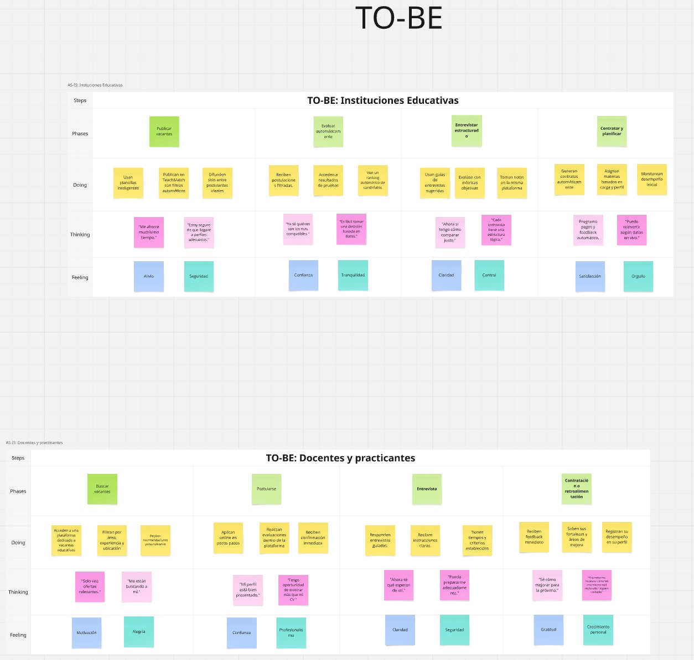

# Capítulo III: Requirements Specification

## 3.1. To-Be Scenario Mapping
En esta sección describimos el proceso que seguimos para construir los To-Be Scenario Mapping de cada segmento objetivo. A partir de los insights obtenidos en el As-Is, realizamos una lluvia de ideas individual, luego revisamos en equipo las fricciones y comportamientos reales observados, identificamos oportunidades de mejora y redefinimos las fases clave del proceso.

Link para acceder al Scenario Mapping: [Scenario Mapping](https://miro.com/welcomeonboard/RlVVeWdnSVBCR3V3TmlDTDlKSFBhL1JvTnJ1K1g5NExnOXFqV2wzWXdPeXRGMVkzdU5JdWJxQ3dvY3lDc2h3YVFqRlg2bzJhOFI5UnQyb2NOWEZsZHZ2cFlmOUZwQUM5RGxNeDFVc3ZZUmEzclNNdENERjUyOE9qZWhPZkE5akp0R2lncW1vRmFBVnlLcVJzTmdFdlNRPT0hdjE=?share_link_id=941959666707)

## 3.2. User Stories

### Epic 1: Autenticacion

**Como** usuario de TeachMatch
**Quiero** tener mi propia cuenta, con correo y contrase;a
**Para** acceder se manera segura a la plataforma.

| Epic / Story ID | Título                              | Descripción                                                                                                                                                                   | Criterios de Aceptación                                                                                                                                                                                                                                                                                                                                                                                                                                                                                                                                                                                                                                                                                                                                                                                                                                                                                 | Relacionado con (Epic ID) |
| --------------- | ----------------------------------- | ----------------------------------------------------------------------------------------------------------------------------------------------------------------------------- | ------------------------------------------------------------------------------------------------------------------------------------------------------------------------------------------------------------------------------------------------------------------------------------------------------------------------------------------------------------------------------------------------------------------------------------------------------------------------------------------------------------------------------------------------------------------------------------------------------------------------------------------------------------------------------------------------------------------------------------------------------------------------------------------------------------------------------------------------------------------------------------------------------- | ------------------------- |
| E1-US1          | Iniciar sesion con correo electronico registrado | **Como** usuario    **Quiero** iniciar sesion con mi correo y contrase;a   **Para** acceder a la plataforma y utilizar las caracteristicas principales.                | **Escenario 1: Inicio de sesion exitoso** • Dado que el usuario está en la pantalla de inicio de sesion • Y escribe sus credenciales • Cuando seleccione el boton de iniciar sesion • Entonces accede a su cuenta y es redirigido al panel segun su rol (docente o institucion).  **Escenario 2: Credenciales incorrectas** • Dado que el usuario se encuentra en el inisio de sesion • Y comete un error al ingresar sus credenciales • Cuando selecciona el boton de iniciar sesion • Entonces aparece un mensaje diciendo que el correo o contrase;a es incorrecto.  | 1                         |
| E1-US2          | Iniciar sesion con cuenta de google                        | **Como** usuario   **Quiero** iniciar sesion con mi cuenta de google   **Para** acceder mas rapidamente y de manera unificada.                                    | **Escenario 1: Inicio de sesion con una cuenta existente** • Dado que el usuario ya tiene una cuenta de google asociada • Cuando accede a la sección de iniciar sesion • Entonces se iniciara la sesion automaticamente y accedera a los servicios ofrecidos por TeachMatch  **Escenario 2: Inicio de sesion con una cuenta no existente** • Dado que el usuario no tiene una cuenta de google asociada • Cuando accede a la sección de iniciar sesion • Entonces el sistema detecta que la cuenta no existe y la vincula automaticamente.                                                                                                                                                                                                                                                                                                                                                                                              | 1                         |
| E1-US3          | Registro con cuenta propia (correo y contrase;a)                     | **Como** nuevo usuario   **Quiero** regisrar mi cuenta con correo y contrase;a   **Para** personalizar mi experiencia segun mi tipo de perfil (docente o institucion).               | **Escenario 1: Registro exitoso** • Dado que el usuario esta en la seccion de registro  • Cuando selecciona su tipo de usuario (docente o institucion) • Entonces se crea la cuenta  • Y se envia un correo de confirmacion.     **Escenario 2: Registro falido por datos incorrectos**  • Dado que el usuario esta en la seccion de registro  • Cuando ingrese datos invalidos o incompletos.  • Entonces no se creara la cuenta.  • Y aparecera un mensaje indicando un error en el formulario.                                                                                                                                                                                                                                                                                                                                                                                                                                                                                                                                                                                                          | 1                         |
| E1-US4          | Reestablecer contrase;a                     | **Como** usuario   **Quiero** poder recuperar mi contrase;a    **Para** establecerla en caso la haya olvidado                      | **Escenario 1: Solicitud de recuperacion valida** • Dado que el usuario esta en la seccion de recuperar contrase;a • Cuando ubgresa el correo asociado a su cuenta • Entonces recibe el enlace para reestablecer la contrase;a     **Escenario 2: Registro falido por datos incorrectos**  • Dado que el usuario esta en la seccion de registro  • Cuando ingrese datos invalidos o incompletos.  • Entonces no se creara la cuenta.  • Y aparecera un mensaje indicando un error en el formulario.    **Escenario 2: Solicitud con correo no registrado**  • Dado que el usuario eingresa un correo no registrado en la plataforma  • Cuando este no se encuentre en la base de datos.  • Entonces envia un enlace de recuperacion.  • Y se mostrara un mensaje informando que no se encontro la cuenta.    **Escenario 3: Actualizacion de contrase;a exitosa**  • Dado que el usuario accede al enlace enviado  • Cuando establezca una contrase;a nueva validad.  • Entonces la contrase;a se actualiza correctamente.  • Y se le informa del cambio mediante un correo.                                                                                                                                                                    | 1                         |

### Epic 2: Busqueda y seleccion de docentes

**Como** institucion usuario de TeachMatch
**Quiero** buscar y seleccionar docentes para mi institucion
**Para** encontrar docentes ideales para mi institucion

| Epic / Story ID | Título                              | Descripción                                                                                                                                                                   | Criterios de Aceptación                                                                                                                                                                                                                                                                                                                                                                                                                                                                                                                                                                                                                                                                                                                                                                                                                                                                                 | Relacionado con (Epic ID) |
| --------------- | ----------------------------------- | ----------------------------------------------------------------------------------------------------------------------------------------------------------------------------- | ------------------------------------------------------------------------------------------------------------------------------------------------------------------------------------------------------------------------------------------------------------------------------------------------------------------------------------------------------------------------------------------------------------------------------------------------------------------------------------------------------------------------------------------------------------------------------------------------------------------------------------------------------------------------------------------------------------------------------------------------------------------------------------------------------------------------------------------------------------------------------------------------------- | ------------------------- |
| E2-US1          | Buscar por nombre del docente | **Como** institucion    **Quiero** buscar a un docente por su nombre   **Para** ver sus cualidades y estadisticas de manera directa                | **Escenario 1: Busqueda con coincidencia exacta** • Dado que el usuario se encuentra en la seccion de busqueda de docentes • Y escribe el nombre de un docente • Cuando seleccione el perfil del docente elegido • Entonces accedera a toda la informacion dreferente al docente buscado.  **Escenario 2: Busqueda sin coincidencia** • Dado que el usuario se encuentra la seccion de busqueda dedocentes • Y comete un error al ingresar el nomre • Entonces aparece un mensaje diciendo que no se ha encontrado un resultado para su buisqueda.  | 1                         |
| E2-US2          | Filtrar por curso dictado                        | **Como** usuario   **Quiero** filtrar por curso dictado (Matematica, Literatura, Ingles, etc)   **Para** visualizar unicamente docentes que dicten el curso de interes                                    | **Escenario 1: Filtrar por un curso especifico** • Dado que el usuario se encuentra en la seccion de busqueda de docentes • Cuando selecciona el curso en el menu de filtros • Entonces solo se le mostrara los docentes que dicten ese curso  **Escenario 2: Cambio de filtro de curso** • Dado que ya hay un curso seleccionado • Cuando el docente seleccione un curso diferente • Entonces el sistema reemplaza el filtro anterior por el nuevo.    •  Y actualiza los resultados.                                                                                                                                                                                                                                                                                                                                                                                          | 1                         |
| E2-US3          | Filtrar por valoracion del docente                     | **Como** usuario institucion   **Quiero** filtrar los perfiles de docentes por su valoracion general   **Para** identificar docentes con alto rendimiento y aptos para mi institucion               | **Escenario 1: Filtrado por calificacion minima** • Dado que usuario esta en la seccion de busqueda  • Cuando selecciona "7.0 en adelante"  • Entonces se mostraran solo los perfiles que cumplan con ese criterio minimo.                                                                                                                                                                                                                                                                                                                                                                                                                                                                                                                                                                                                            | 1                         |
| E2-US4          | Eliminar filtros aplicados                     | **Como** usuario   **Quiero** poder eliminar uno o mas filtros de busqueda    **Para** visualizar nuevamente a todos los docentes sin restricciones                      | **Escenario 1: Eliminar todos lo filtros ** • Dado que el usuario aplico filtros • Cuando presiona el boton de quitrar filtros • Entonces todos los filros se eliminan y vuelven a mostrar resultados sin restricciones     **Escenario 2: Eliminar filtro individual**  • Dado que hay filtros activos  • Cuando presiona la "X" junto al filtro.  • Entonces solo ese filtro se elimina y el resto se mantiene.    **Escenario 3: No hay filtros aplicados**  • Dado el usuario no ha aplicado ningun filtro  • Entonces el sistema no muestra la opcion para eliminar filtros                                                                                                                                                           | 1                         |

### Epic 3: Dashboard personalizado y calificacion
**Como** docente usuario de TeachMatch
**Quiero** un panel donde ver mi historial de contratos, calificaiones y horarios
**Para** evaluar mi rendimiento, y analizar las sugerencias de los alumnos/test

| Epic / Story ID | Título                              | Descripción                                                                                                                                                                   | Criterios de Aceptación                                                                                                                                                                                                                                                                                                                                                                                                                                                                                                                                                                                                                                                                                                                                                                                                                                                                                 | Relacionado con (Epic ID) |
| --------------- | ----------------------------------- | ----------------------------------------------------------------------------------------------------------------------------------------------------------------------------- | ------------------------------------------------------------------------------------------------------------------------------------------------------------------------------------------------------------------------------------------------------------------------------------------------------------------------------------------------------------------------------------------------------------------------------------------------------------------------------------------------------------------------------------------------------------------------------------------------------------------------------------------------------------------------------------------------------------------------------------------------------------------------------------------------------------------------------------------------------------------------------------------------------- | ------------------------- |
| E3-US1          | Ver historial de contratos | **Como** docente    **Quiero** acceder a un listado con todos mis contratos (exxperiencia laboral)   **Para** mostrarlo en mi perfil de docente                | **Escenario 1: Visualizacion del historial de contratos** • Dado que el usuario ha iniciado sesion correctamente • Y accede a su dashboard personal  • Cuando selecciona la opcion de historial de contratos • Entoncesel sistema muestra una lista cronologia de las instituciones en las que ha trabajado.  **Escenario 2: No hay contratos anteriores** • Dado el docente ha iniciado sesion • Y aun no ha sido contratado por ninguna institucion • Cuando accede a la seccion de historial de contratos  •Entonces el sistema muestra un mensaje diciendo que no tiene contratos registrados.  | 1                         |
| E3-US2          | Ver calificaciones recibidas                        | **Como** docente   **Quiero** consultar las calificaciones y comentarios que he recibido de mis alumnos   **Para** entender como se ha percibio mi desempe;o y mejorar como docente                                    | **Escenario 1: Ver lista de calificaciones por contrato** • Dado que el usuario accede a su dashboard • Cuando selecciona la pesta;a de "Calificaciones"  • Entonces se le muestran las calificaciones recibidas por sus alumnos e instituciones en las que ya haya trabajado.  **Escenario 2: No hay calificaciones disponibles** • Dado el docente accedio a la seccion de calificaicones • Y no ha recibido calificaciones todavia • Entonces el sistema muestra un mensaje indicando que aun no ha sido calificado,                                                                                                                                                                                                                                                                                                                                                                                       | 1                         |
| E3-US3          | Ver metricas de rendimiento                    | **Como** docente   **Quiero** tener acceso a estadisticas como demoras en entregas, faltas y sanciones aplicadas a alumnos   **Para** monitorear mi rendimiento como docente              | **Escenario 1: Ver panel de metricas** • Dado que el docente accede a su dashboard  • Cuando la seccion de "Estadisticas"  • Entonces vera graficas que muestren datos acumulados de sus faltas, tardanzas, sanciones, etc.    **Escenario 2: No hay datos disponibles**   • Dado que el docente es nuevo en la plataforma   • Y no tiene contratos vigentes    • Cuando acceda a "Estadisticas"  • Entonces se le mostrara un mensaje diciendo que las metricas apareceran al formar parte de una institucion y obtener datos.                                                                                                                                                                                                                                                                                                                                                                                                                                                                                                                                                                                                      | 1                         |

### Epic 4: Ver perfiles de usuario
**Como**  usuario de TeachMatch
**Quiero** ver mi perfil tanto mio como de otros usuarios.
**Para** conocer que docentes contratar/que instituciones postular.

| Epic / Story ID | Título                              | Descripción                                                                                                                                                                   | Criterios de Aceptación                                                                                                                                                                                                                                                                                                                                                                                                                                                                                                                                                                                                                                                                                                                                                                                                                                                                                 | Relacionado con (Epic ID) |
| --------------- | ----------------------------------- | ----------------------------------------------------------------------------------------------------------------------------------------------------------------------------- | ------------------------------------------------------------------------------------------------------------------------------------------------------------------------------------------------------------------------------------------------------------------------------------------------------------------------------------------------------------------------------------------------------------------------------------------------------------------------------------------------------------------------------------------------------------------------------------------------------------------------------------------------------------------------------------------------------------------------------------------------------------------------------------------------------------------------------------------------------------------------------------------------------- | ------------------------- |
| E4-US1          | Ver perfil publico de un docente o institucion | **Como** usuario    **Quiero** ver el perfil publico de un docente o institucion educativa   **Para** conocer la experiencia, desempe;o y reputacion antes de generar un contrato.               | **Escenario 1: Visualizacion del perfil completo ** • Dado que el usuario ha iniciado sesion correctamente • Cuando accede al perfil de otro usuario desde una busqueda  • Entonces se muestra la biografia, estadisticas, reputacion y desempe;o del perfil | 1                         |
| E4-US2          | Ver como se muestra mi perfil                        | **Como** usuario   **Quiero** ver como se muestra mi perfil a otros usuarios   **Para** verificar que la informacion que se comparte sobre mi sea correcta y mejorar lap resentacion si es necesario                                  | **Escenario 1: Acceso a vista publica del perfil personal** • Dado que el usuario ha iniciado sesion • Cuando selecciona la opcion de "Ver mi perfil"  • Entonces se le muestra como otros usuarios verian su perfil, incluyendo biografia, imagenes, estadisticas, etc.   **Escenario 2: No hay metricas suficientes** • Dado el usuairo es nuevo o no tiene ningun contrato • Cuando acceda a su perfil   Entonces el sistema mostrara informacion incompleta en los campos faltantes                                                                                                                                                                                                                       | 1                         |
| E4-US3          | Ver reputacion y calificaciones del usuario                    | **Como** usuario   **Quiero** ver la calificacion promedio de un docente o reputacion de una institucion   **Para** evaluar un posible contrato con ellos              | **Escenario 1: Usuario con reputacion disponible** • Dado que el usuario accede a un perfil de otro usuario • Cuando accede a "reputacion"  • Entonces el sistema muestra calificaiones promedio, comentarios recibidos y distinciones en el caso de instituciones educativas.    **Escenario 2: No hay historial de calificaciones**   • Dadp que el usuario accede a un perfil sin contratos previos   •Entonces el sistema muestra un mensaje diciendo que no hay estadisticas disponibles.                                                                                                                                                                                                                                                                                                                                                                                                                                                                                                                             | 1                         |
## 3.3. Impact Mapping

## 3.4. Product Backlog

| Prioridad | Epic/Story ID | Título                                       | Descripción                                                                                                                                                                   | SP |
| --------- | -------- | -------------------------------------------- |-------------------------------------------------------------------------------------------------------------------------------------------------------------------------------| -- |
| 1         | E1-US01    | Iniciar sesion con correo electronico registrado               | **Como** usuario **Quiero** iniciar sesion con mi correo y contrase;a **Para** acceder a la plataforma y utilizar las caracteristicas principales.                              | 3  |
| 2         | E2-US01    | Buscar por nombre del docente                | **Como** institucion  **Quiero** buscar a un docente por su nombre **Para** ver sus cualidades y estadisticas de manera directa                                       | 2  |
| 3         | E2-US02    | Filtrar por curso dictado                  | **Como** usuario **Quiero** filtrar por curso dictado (Matematica, Literatura, Ingles, etc) **Para** visualizar unicamente docentes que dicten el curso de interes                               | 3  |
| 4         | E3-US03    | Ver metricas de rendimiento                 | **Como** docente **Quiero** tener acceso a estadisticas como demoras en entregas, faltas y sanciones aplicadas a alumnos  **Para** monitorear mi rendimiento como docente                                      | 5 |
| 5         | E4-US01    | Ver perfil publico de un docente o institucion                         | **Como** usuario **Quiero** ver el perfil publico de un docente o institucion educativa **Para** conocer la experiencia, desempe;o y reputacion antes de generar un contrato.                                                                     | 3  |

