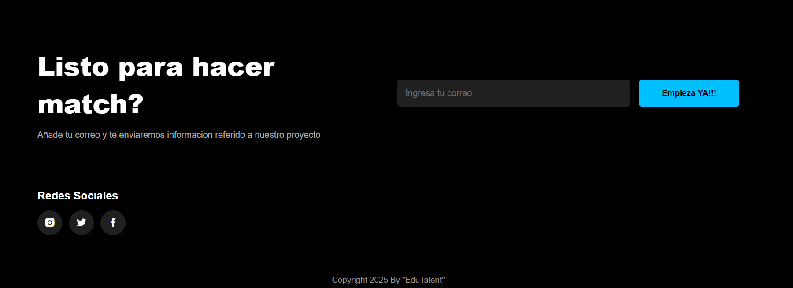

# **Capítulo V: Product Implementation, Validation & Deployment**

## **5.1. Software Configuration Management**
Durante el desarrollo del proyecto se emplearán diversas herramientas de trabajo. 

### **5.1.1. Software Development Environment Configuration**

En la siguiente sección se presentan las herramientas de software utilizadas durante el desarrollo del proyecto, junto con las rutas de acceso a cada producto, con el fin de asegurar una colaboración eficiente entre los miembros del equipo.

#### **Herramientas Utilizadas en el Proyecto**

#### **Gestión de Proyectos**

- **WhatsApp**: [https://web.whatsapp.com/](https://web.whatsapp.com/)  
  Empleamos WhatsApp como nuestro medio principal de comunicación, lo que permitió una coordinación fluida del equipo, el seguimiento de actividades y el intercambio constante de ideas a lo largo del desarrollo.

#### **Diseño UX/UI del Producto**

- **Figma**: [https://www.figma.com](https://www.figma.com)  
  Esta herramienta fue utilizada como base para el diseño visual del sistema, facilitando la elaboración de wireframes y mockups tanto de la landing page.

- **Uxpressia**: [https://uxpressia.com/](https://uxpressia.com/)  
  A través de Uxpressia, desarrollamos perfiles de usuario (User Personas) y Mapas de Empatía, impact mapping, elementos clave para comprender mejor las necesidades y expectativas de los usuarios finales.

- **Lucidchart**: [https://www.lucidchart.com/pages/](https://www.lucidchart.com/pages/)  
  Lucidchart nos permitió crear  diagrama de clases y base de datos.

#### **Modelado de Software**

- **Visual Paradigm**: [https://www.visual-paradigm.com/](https://www.visual-paradigm.com/)  
  Con Visual Paradigm elaboramos los diagramas C4 que describen los niveles arquitectónicos del sistema.

#### **Control de Versiones y Documentación**

- **GitHub**: [https://github.com/](https://github.com/)  
  Utilizamos GitHub como plataforma para gestionar la documentación del proyecto, facilitando la colaboración entre los integrantes del equipo y llevando un control detallado de los cambios realizados mediante los commits individuales.

### **5.1.2. Source Code Management**

La organización y administración de las modificaciones realizadas en el proyecto se llevaron a cabo mediante la creación de un repositorio en GitHub. La estructura de este repositorio se organizó de la siguiente forma:

#### **Estructura del Repositorio**

- **Repositorio en GitHub**: [https://github.com/1ASI0730-2510-4366-G1-EduTalent](https://github.com/1ASI0730-2510-4366-G1-EduTalent)  
- **Landing Page**: [https://github.com/1ASI0730-2510-4366-G1-EduTalent/Landing-Page](https://github.com/1ASI0730-2510-4366-G1-EduTalent/Landing-Page)

#### **Ramas Principales**

- **`main`**: Esta rama almacena las versiones finales del repositorio, que son las que se pasan a producción una vez validadas.

- **`develop`**: Es utilizada como punto de integración de las ramas de nuevas funcionalidades (`feature`). Una vez que el equipo determina que la integración está lista, se pasa a la rama `develop` para su revisión final.

#### **Ramas Auxiliares**

- **`refactor/structure`**: Estas ramas están destinadas al desarrollo de funcionalidades generales que serán integradas posteriormente en la rama `develop`. Estas funcionalidades corresponden a las peticiones de los usuarios, tanto para la página de inicio como para la aplicación web.  
  Un ejemplo de estas ramas es `feature/navbar`.

### **5.1.3. Source Code Style Guide & Conventions**

Para garantizar la coherencia y calidad en el desarrollo de nuestra Landing Page y la aplicación web, se implementarán una serie de convenciones específicas para los diferentes lenguajes y tecnologías que utilizamos:

#### **HTML**

- **Tipo de Documento**: Todos los archivos HTML comenzarán con `<!DOCTYPE html>` para asegurar una interpretación correcta del documento.
- **Uso de Minúsculas**: Las etiquetas y atributos HTML siempre estarán en minúsculas, como `<body>` y `
`.
- **Cierre de Etiquetas**: Las etiquetas se cerrarán adecuadamente para mantener una estructura ordenada.
- **Atributos con Comillas**: Los valores de los atributos siempre estarán entre comillas, por ejemplo, `<a href="https://example.com">`.
- **Especificaciones de Imágenes**: Se añadirán los atributos `alt`, `width` y `height` en las imágenes para mejorar la accesibilidad y asegurar un diseño responsivo.
- **Atributos sin Espacios**: No habrá espacios alrededor del signo igual en los atributos, por ejemplo, `<link rel="stylesheet" href="styles.css">`.
- **Elemento `<title>`**: No se omitirá el elemento `<title>`, ya que es fundamental para el SEO y la accesibilidad del sitio.
- **Idioma y Codificación**: Usaremos el atributo `lang` para definir el idioma del documento y `<meta charset="UTF-8">` para la codificación de caracteres.
- **Uso de HTTPS**: Todos los recursos externos, como fuentes y multimedia, se cargarán mediante HTTPS para garantizar la seguridad, por ejemplo:  
  `@import 'https://fonts.googleapis.com/css?family=Open+Sans';`.

#### **CSS**

- **Nombres en Minúsculas**: Todos los nombres de elementos, atributos y valores estarán en minúsculas para asegurar consistencia, por ejemplo: `color: #e5e5e5;`.
- **Clases Descriptivas**: Las clases CSS tendrán nombres claros que describan su propósito y estarán separadas por guiones, como `.barra-navegacion`, `.autor-articulo`.
- **Propiedades Abreviadas**: Se emplearán propiedades abreviadas siempre que sea posible, para reducir el tamaño del código y mejorar la legibilidad, por ejemplo: `border-top: 0;`.
- **Colores Hexadecimales Reducidos**: Se utilizarán colores en formato hexadecimal de tres caracteres cuando sea aplicable, como `color: #ebc;`.
- **Orden Alfabético**: Las propiedades CSS dentro de un bloque estarán organizadas en orden alfabético para facilitar su mantenimiento.
- **Uso de Punto y Coma**: Cada declaración CSS terminará con un punto y coma para evitar errores de interpretación, por ejemplo: `display: block;`.
- **Espaciado Consistente**: Se aplicará un espacio después de los dos puntos en las declaraciones y entre las llaves que abren un bloque, como en `font-weight: bold;`.
- **Comillas Simples en Atributos**: Los valores de los atributos en CSS se escribirán entre comillas simples, por ejemplo:  
  `font-family: 'Open Sans', Arial, sans-serif;`.
#### **JS**

 - **El fragmento de código JavaScript se utiliza para mejorar la experiencia del usuario en la interfaz web, agregando interactividad tanto al encabezado como al menú de navegación.  
 - **Sticky Header**: La primera parte del script aplica la clase `sticky` al elemento `<header>` cuando el usuario hace scroll más de 60 píxeles, logrando que el encabezado permanezca visible en la parte superior de la pantalla.  
 - **Menú Responsive**: La segunda parte controla la funcionalidad del menú responsive. Al hacer clic en el ícono con el ID `menu-icon`, se alterna la clase `bx-x` para cambiar el ícono (por ejemplo, de hamburguesa a una "X") y se activa o desactiva la clase `open` en la barra de navegación `.navbar`, permitiendo mostrar u ocultar el menú según la interacción del usuario.

### **5.1.4. Software Deployment Configuration**

Creamos un repositorio en la organización de nuestro equipo en GitHub, donde subimos los archivos necesarios para desplegar la landing page. El despliegue se realizó mediante **GitHub Pages**.

1. **Subida de Archivos**: Subimos los archivos requeridos al repositorio correspondiente.

2. **Configuración de GitHub Pages**: Luego, accedemos a **Settings** y localizamos la opción **Pages**.

3. **Selección de Rama**: En el apartado de **Branch**, seleccionamos la rama **main** y guardamos los cambios.

4. **Generación del Enlace**: Tras unos minutos, **GitHub** genera el enlace de acceso a nuestra página web.
5. 

## **5.2. Landing Page, Services & Applications Implementation**

### **5.2.1. Sprint 1**
#### **5.2.1.1. Sprint Planning 1**
Un sprint es un periodo breve y estructurado en el que se desarrollan tareas concretas dentro de un proyecto, siguiendo los principios de metodologías ágiles como Scrum. El **Sprint #1**, que inicia el 08 de abril de 2025, tiene como objetivo desarrollar una landing page atractiva y funcional para **TEACHmatch**. Esta página busca captar la atención de los usuarios e informar de forma clara sobre los beneficios del sistema de contratación docente que ofrecemos.

| **Sprint**                          | Sprint 1                                      |
|-------------------------------------|-----------------------------------------------|
| **Sprint Planning Background**      |                                               |
| **Date**                             | 08/04/2025                                    |
| **Time**                             | 19:00 horas (GMT-5)                           |
| **Location**                         | Modalidad remota a través de la plataforma WhatsApp |
| **Prepared By**                      |                                               |
| **Attendees (Planning Meeting)**     | Sebastián Alonso Bustinza Muñoz Jean Pool Huamán De La Cruz Daniel Eduardo Rodríguez Aguilar Luis Sebastián Rubio Ortiz Tony Do Santos Torres Cortez |
| **Sprint 0 Review Summary**          | Dado que es nuestro sprint inicial de desarrollo, aún no se ha realizado un resumen del sprint. |
| **Sprint 0 Retrospective Summary**   | Al tratarse del sprint inicial, todavía no se han identificado áreas de mejora o ajustes de proceso. |
| **Sprint 1 Goal**                    | Durante este sprint, se priorizó el desarrollo de la landing page. Para ello, se revisaron y ajustaron tanto los textos como el diseño previamente elaborado en Figma. Al concluir el sprint, se espera que la página esté desplegada en GitHub Pages, permitiendo que cualquier usuario pueda acceder a ella mediante un enlace público. |
| **Sprint 1 Velocity**                | 24                                            |
| **Sum of Story Points**             | 24                                            |

#### **5.2.1.2. Sprint Backlog 1**
En esta sección se detallan las tareas realizadas durante el **Sprint 1** del proyecto **TEACHmatch**.
Durante el primer sprint backlog, el equipo se planteó como meta iniciar y completar el desarrollo de la landing page. Para coordinar el trabajo y distribuir responsabilidades, se empleó Trello, una herramienta que facilitó la división de las historias de usuario en tareas concretas, asignándolas a los integrantes según sus fortalezas. El objetivo central de este sprint fue lograr una landing page completamente funcional y visualmente atractiva. 
**Enlace de Trello:** [Accede al tablero de Trello para Sprint 1](https://trello.com/b/1zyQJDjB/edutalent)

| **ID**       | **Historia de Usuario**                                | **ID** | **Tarea**                                 | **Descripción**                                                              | **Estimación (Horas)** | **Asignado a**                         | **Estado (Por Hacer / En Proceso / En Revisión / Hecho)** |
|--------------|---------------------------------------------------------|--------|-------------------------------------------|-------------------------------------------------------------------------------|------------------------|----------------------------------------|-----------------------------------------------------------|
| **E1-US01**  | Desarrollo de la Landing Page de TEACHmatch              | T1     | Crear estructura básica de la página       | Desarrollo inicial de la estructura HTML y diseño básico de la página         | 3                      | Tony Do Santos Torres Cortez            | Hecho                                                    |
| **E1-US02**  | Diseño de la página de inicio (Hero)                    | T2     | Implementar sección Hero                   | Diseño y desarrollo de la sección de bienvenida (Hero) en la landing          | 2                      | Tony Do Santos Torres Cortez            | Hecho                                                    |
| **E1-US03**  | Creación de secciones informativas (About, Planes, etc.)| T3     | Crear sección About                        | Desarrollo de la sección "Sobre Nosotros" con el contenido textual y visual   | 2                      | Tony Do Santos Torres Cortez            | Hecho                                                    |
| **E1-US04**  | Desarrollo de la funcionalidad de inicio de sesión      | T4     | Crear formulario de inicio de sesión       | Implementación de formulario y validación para el inicio de sesión            | 4                      | Daniel Eduardo Rodriguez Aguilar        | Hecho                                                    |
| **E1-US05**  | Implementación de footer y enlaces de redes sociales    | T5     | Crear footer con enlaces sociales          | Desarrollo del pie de página con enlaces a redes sociales                     | 2                      | Luis Sebastián Rubio Ortiz              | Hecho                                                    |
| **E1-US06**  | Funcionalidad y Pruebas                                 | T6     | Realizar pruebas de funcionalidad          | Pruebas de usabilidad para verificar que las secciones son funcionales        | 3                      | Sebastián Alonso Bustinza Muñoz         | Hecho                                                    |
| **E1-US07**  | Revisión Final y Feedback                               | T7     | Revisión final de la landing page          | Revisión de todos los elementos de la landing page y feedback del equipo      | 1                      | Jean Pool Huaman De La Cruz             | Hecho                                                    |
| **E1-US01**  | Desarrollo de la Landing Page de TEACHmatch              | T8     | Diseño de la página de inicio (Hero)       | Diseño de la imagen y la estructura de la página de inicio                    | 2                      | Sebastián Alonso Bustinza Muñoz         | Hecho                                                    |
| **E1-US02**  | Diseño de la página de inicio (Hero)                    | T9     | Crear sección Hero (Revisión)              | Revisión final del diseño y ajustes de la sección Hero                        | 1                      | Jean Pool Huaman De La Cruz             | Hecho                                                    |
| **E1-US04**  | Desarrollo de la funcionalidad de inicio de sesión      | T10    | Crear formulario de inicio de sesión (Rev.)| Revisión del código de validación y pruebas del formulario                    | 3                      | Daniel Eduardo Rodriguez Aguilar        | Hecho                                                    |
| **E1-US05**  | Implementación de footer y enlaces de redes sociales    | T11    | Diseño de pie de página                    | Diseño de los elementos visuales del pie de página                             | 1                      | Luis Sebastián Rubio Ortiz              | Hecho                                                    |

#### **5.2.1.3. Development Evidence for Sprint Review**

Durante el Sprint 1, el desarrollo de la landing page se realizó mayoritariamente en entornos locales por parte del equipo, con colaboración constante a través del intercambio de código y comunicación en el grupo de trabajo. Si bien parte del desarrollo se efectuó fuera de GitHub, sí se realizaron algunos commits y actualizaciones directamente en el repositorio del proyecto, principalmente para el despliegue final y ajustes menores. Se utilizó Figma para el diseño visual y GitHub Pages para poner la landing page en producción, asegurando su disponibilidad pública mediante un enlace accesible al cierre del sprint.

A continuación, se detalla la evidencia de actividad registrada en el repositorio del proyecto:

| Repository | Branch     | Commit ID | Commit Message          | Committed on       |
|------------|------------|-----------|--------------------------|--------------------|
| [Landing-Page](https://github.com/1ASI0730-2510-4366-G1-EduTalent/Landing-Page) | main       | 86941ab   | Update index.html         | Apr 26, 2025 |
| Landing-Page | main       | bf87efa   | Update index.html         | Apr 26, 2025 |
| Landing-Page | main       | 20b5084   | Update index.html         | Apr 26, 2025 |
| Landing-Page | main       | aeef1ba   | Delete style.css          | Apr 26, 2025 |
| Landing-Page | main       | 92a79fb   | Add files via upload      | Apr 26, 2025 |
| Landing-Page | main       | 2f658c4   | Add files via upload      | Apr 26, 2025 |
| Landing-Page | main       | cba7969   | Delete README.md          | Apr 26, 2025 |
| Landing-Page | main       | 98ab3ed   | Update index.html         | Apr 26, 2025 |
| Landing-Page | main       | eeba095   | Create .algo              | Apr 26, 2025 |
| Landing-Page | main       | 5fb4258   | Add files via upload      | Apr 26, 2025 |
| Landing-Page | main       | f47d211   | Delete script.js          | Apr 26, 2025 |
| Landing-Page | main       | 10a35e9   | Delete css/.algo          | Apr 26, 2025 |

### 5.2.1.4. **Testing Suite Evidence for Sprint Review**

Para la entrega del Sprint 1, nos centramos en el desarrollo completo, implementación y despliegue de la Landing Page de *TEACHmatch*. En este contexto, la sección de “Testing” se orientó principalmente a cumplir con los requerimientos del usuario, priorizando una estructura clara, accesible y fácil de navegar.

| Repository | Branch | Commit ID | Commit Message       | Committed on (Date) |
|------------|--------|-----------|-----------------------|----------------------|
| [https://github.com/1ASI0730-2510-4366-G1-EduTalent/Landing-Page](https://github.com/1ASI0730-2510-4366-G1-EduTalent/Landing-Page) | main   | 86941ab   | Update index.html     | 25/04/2025           |

#### **5.2.1.5. Execution Evidence for Sprint Review**

En el primer sprint se alcanzó un progreso parcial en la implementación y despliegue de la landing page. Esta página cuenta con diversas secciones donde los usuarios pueden acceder a información clave sobre el producto y la startup. A continuación, se presentan algunas pruebas de este avance.

#### **5.2.1.6. Services Documentation Evidence for Sprint Review**

En este Sprint 1, el enfoque principal ha sido la creación de la Landing Page de la aplicación **TEACHmatch**, por lo que no se ha avanzado aún en la documentación de los servicios. No obstante, está previsto que dicha documentación se desarrolle y se incluya en los próximos sprints, conforme se avance en el desarrollo de los componentes funcionales del sistema.

#### **5.2.1.7. Software Deployment Evidence for Sprint Review**

#### **5.2.1.8. Team Collaboration Insights during Sprint**
