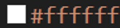

# Capítulo IV: Product Design

## 4.1. Style Guidelines
### 4.1.1. General Style Guidelines
Es un conjunto de normas que determinan como se debe redactar, diseñar o presentar documentos, contenido en línea, software u otro trabajos. A continuación, detallaremos los parámetros implementados en la estructura del proyecto.

Branding:

Brand Overview:
TeachMatch está diseñado para optimizar el proceso de selección y seguimiento del personal docente en una institución educativa. Gracias a las diferentes funciones que dispone permite optimizar las gestión y selección del equipo docente para las instituciones educativas.
 - Misión: Mejorar la calidad educativa mediante una plataforma que integra y optimiza la selección, contratación y seguimiento del talento docente, conectando instituciones con profesionales capacitados, fomentando así el desarrollo continuo y garantizando una enseñanza de excelencia.
 - Visión: Ser la plataforma líder en gestión docente en Latinoamérica, transformando la forma en que las instituciones educativas identifican, contratan y desarrollan a sus profesores, asegurando una educación de calidad y sostenible a través de la tecnología.

  

Brand Name: 
Teachmatch surgen de la combinación de las palabras “teach” que significa enseñar en ingles y “match” que hace referencia a hacer pares. Esta aplicación esta diseñada para agilizar y optimizar la selección del personal docente de instituciones educativas.

 

Colores: 
Los colores desempeñan un papel importante en la primera impresión para los usuarios ya que les fa un perspectiva mas suave y agradable visualmente sobre nuestra aplicación incitándolos a navegar entre las diferentes funciones de las que disponemos. Usamos un color blanco para el color del texto estándar, ya que en combinación al color de fondo negro que escogimos se mezclan para mostrar información limpia y nítida fácil de captar para el espectador. Acompañado de un color celeste para resaltar botones y ciertas palabras claves que definen tanto startup como producto.

Color de texto:

 

Color de background:

 

Color principal:

 

Tipografía:
La tipografía juega un papel de suma importancia para establecer diferentes jerarquías entre la información que hay en el landing page presentado. Para el presente proyecto, utilizamos “Open Sans” importado desde “Google Font”. A nuestro parecer , un estilo moderno, limpio y legible para el usuario.
Encabezados y sus respectivos píxeles:

- **H1**: tamaño de **96px**
- **H2**: tamaño de **48px**
- **H3**: tamaño de **17px**
- **H4**: tamaño de **16px**

### 4.1.2. Web Style Guidelines

Para el enfoque de nuestra aplicación TEACHmatch, empleamos diversos recursos para lograr una página limpia, cómoda e intuitiva para el usuario. Al principio de todo, tenemos una barra de navegación que además de mostrar el nombre de nuestro producto también contiene el inicio que muestra la primera pantalla que vera el usuario cuando ingrese, el apartado de información para saber como es que funciona TEACHmatch, el apartado de Planes para saber los diferentes beneficios y costos que puede tener afiliarte a nosotros y un apartado de contactarnos para registrarte y recibir boletines semanales, ofertas de trabajo o estados de procesos en la página.
 -	Imágenes:
En el diseño, utilizamos diferentes imágenes que hacen referencia a nuestra misión y visión. Además que están colocadas acorde a los diferentes apartados que hay en la página. De tal manera, que optimizamos la experiencia de usuario y evitamos interrupciones y/o mal uso de las rutas por parte de nuestros usuarios.
 -	Botones:
Empleamos botones, para agilizar la experiencia del usuario primero acortando los viajes entre secciones ya que cada apartado en al barra superior nos dirige de inmediato al tópico que el usuario quiere conocer. Adicionalmente, también hay botones para mostrar más información para que le usuario aclare sus dudas sobre nuestro servicio.
 -	Animaciones:
En algunas secciones tenemos diferentes efectos para captar la atención del usuario logrando así una aplicación suave y didáctica para nuestros clientes. Por ejemplo, el efecto blur que proporciona una animación suave que permite en adición a un zoom enterarse sobre nuestros beneficios.

## 4.2. Information Architecture

Dado que TeachMatch gestiona un flujo funcional clave para la selección y contratación de docentes, es fundamental que el usuario tenga claridad sobre las etapas y procesos involucrados en nuestra aplicación. La información está presentada de manera categórica y secuencial, permitiendo al usuario desplazarse ebtre los diferentes modulos que forman parte nuestros procesos de selección, getión y contratación.

### 4.2.1. Organization Systems

El sistema de organización de la aplicación TEACHmatch se distribuye con vistas de manera jerárquica, resaltando de esta manera los elementos mas importante en la pantalla. Gracias a este enfoque, captamos la atención del usuario, y le incitamos a revisar los diferentes tópicos y apartados que posee nuestra web. Enmarcamos en la pantalla inicial nuestro slogan, que transmite una método moderno, novedoso y fresco para poder aplicar a diferentes trabajos para el área docente.

### 4.2.2. Labeling Systems

En nuestra aplicación TeachMatch, el sistema de etiquetas está cuidadosamente organizado para garantizar una navegación clara y efectiva para los usuarios. La etiqueta Inicio lleva a los usuarios al comienzo del sitio. Sobre Nosotros los desplaza hacia una sección donde se presenta a los desarrolladores del proyecto. Información describe el funcionamiento de la plataforma y sus beneficios. Planes presenta las opciones de suscripción disponibles, con detalles de las características de cada plan. Contact us dirige a un formulario donde los usuarios pueden registrarse para recibir información adicional. 

### 4.2.3. SEO Tags and Meta Tags

| Attribute    | Value                                                                                          |
|--------------|------------------------------------------------------------------------------------------------|
| Charset      | UTF-8                                                                                           |
| Viewport     | width=device-width, initial-scale=1.0                                                           |
| CSS Link     | css/style.css                                                                                 |
| Title        | TeachMatch - Tu mejor clase empieza con un match                                                |
| Description  | Centrada en optimizar la gestion y seleccion de profesionales para el área docente
| Keywords     |contratacion de docentes, gestión educativa, capacitación de docentes, vacantes escolares, educación"> |
| Author       | EduTalent Team                                                                                 |

### 4.2.4. Searching Systems

En TEACHmatch, siempre priorizaremos la experiencia y agilidad en procesos. Entre las principales funcionalidades añadiremos filtros para encontrar vacantes y/o personal que cumpla con características en específico que beneficien ambas partes por igual. De igual manera, se implementará un historial para acceder a información previamente buscada rápidamente.

### 4.2.5. Navigation Systems

## 4.3. Landing Page UI Design

### 4.3.1. Landing Page Wireframe

### 4.3.2. Landing Page Mock-up

## 4.4. Web Applications UX/UI Design.

### 4.4.1. Web Applications Wireframes.
Presentamos los wireframes de la aplicación web, proporcionando una visión clara de la estructura y disposición de las diferentes páginas y funcionalidades. Los wireframes son representaciones visuales que muestran la organización de los elementos en la interfaz de usuario.
Link a los Wireframes de la Web Application (Figma): **https://www.figma.com/design/KZdBg10Rl4d5UXpjeWWIIG/Wireframes-Teachteam?node-id=0-1&t=1N0rY45JVydGcPRw-1**

## Log in
Esta es la página principal de la aplicación web, donde los usuarios pueden acceder a las funcionalidades principales y obtener una visión general del sistema.

## Dashboard
Vista principal para el coordinador académico. Presenta estadísticas clave como el número de vacantes publicadas y candidatos nuevos. También muestra eventos próximos de contratación.

## Vacantes Publicadas
Sección que muestra la lista de vacantes activas y cerradas. Permite al coordinador ver, editar o cerrar vacantes, así como crear nuevas. Cada vacante incluye información sobre el área, la fecha de publicación y el estado actual.

## Evaluación de Candidato
Pantalla detallada que muestra los resultados del test pedagógico y psicométrico de un postulante, junto con respuestas a preguntas de una entrevista automatizada. Al final se muestra el nivel de compatibilidad general con el perfil requerido, y opciones para contratar o descartar.

## Seguimiento de Docente
Pantalla de monitoreo del desempeño de los docentes recién contratados. Permite consultar el estado de la capacitación inicial, revisar evaluaciones mensuales y registrar retroalimentación entre docentes y directivos.

### 4.4.2. Web Applications Wireflow Diagrams
Presentamos los diagramas de flujo de la aplicación web, proporcionando una visión clara de la navegación y las interacciones entre las diferentes páginas y funcionalidades. Los diagramas de flujo son representaciones visuales que muestran la secuencia de acciones y decisiones que los usuarios pueden tomar.

Link a los Wireframes de la Web Application (Figma): https://www.figma.com/proto/KZdBg10Rl4d5UXpjeWWIIG/Wireframes-Teachteam?node-id=2-24&p=f&t=hU2sNT0LfeCNwo3m-0&scaling=min-zoom&content-scaling=fixed&page-id=0%3A1&starting-point-node-id=2%3A24

Segment objetivo: Instituciones Educativas
- **User Goal:** Como director de una institución educativa deseo ver mis vacantes de trabajo abiertas.

El director se dirige a la sección "Job Openings", luego podrá visualizar todas sus vacantes públicas.
- **User Goal:**  Como director de una institución educativa deseo ver a los candidatos de mis ofertas de trabajo abiertas.

El director se dirige a la sección "Candidates", luego podrá visualizar todos los candidatos.
- **User Goal:** Como director de una institución educativa deseo hacer seguimiento a cada docente.

El director se dirige a la sección "Teachers", luego podrá hacer seguimiento a cada docente de la institución.

### 4.4.3. Web Applications Mock-ups.
En esta sección, presentamos los mock-ups de la aplicación web, proporcionando una visión detallada de la apariencia final de las diferentes páginas y funcionalidades. Son representaciones visuales de alta fidelidad que muestran el diseño y la interfaz de usuario, permitiendo una comprensión clara de cómo funcionará la aplicación.

Link al Web Application Mock-up (Figma):  
**https://www.figma.com/design/uR6pQDBmEuAIShow0wWztY/Mock-ups-Teachteam?node-id=0-1&p=f&t=z51IP7F5ffXVu4Um-0**

## Log in
Esta es la página principal de la aplicación web, donde los usuarios pueden acceder a las funcionalidades principales y obtener una visión general del sistema.

## Dashboard
Vista principal para el coordinador académico. Presenta estadísticas clave como el número de vacantes publicadas y candidatos nuevos. También muestra eventos próximos de contratación.

## Vacantes Publicadas
Sección que muestra la lista de vacantes activas y cerradas. Permite al coordinador ver, editar o cerrar vacantes, así como crear nuevas. Cada vacante incluye información sobre el área, la fecha de publicación y el estado actual.

## Evaluación de Candidato
Pantalla detallada que muestra los resultados del test pedagógico y psicométrico de un postulante, junto con respuestas a preguntas de una entrevista automatizada. Al final se muestra el nivel de compatibilidad general con el perfil requerido, y opciones para contratar o descartar.

## Seguimiento de Docente
Pantalla de monitoreo del desempeño de los docentes recién contratados. Permite consultar el estado de la capacitación inicial, revisar evaluaciones mensuales y registrar retroalimentación entre docentes y directivos.

### 4.4.4. Web Applications User Flow Diagrams
Link a los Wireframes de la Web Application (Figma): https://www.figma.com/proto/uR6pQDBmEuAIShow0wWztY/Mock-ups-Teachteam?node-id=1-137&p=f&t=xvl7vadXUDr0PxKK-0&scaling=min-zoom&content-scaling=fixed&page-id=0%3A1&starting-point-node-id=1%3A137

Segment objetivo: Instituciones Educativas
- **User Goal:** Como director de una institución educativa deseo ver mis vacantes de trabajo abiertas.

El director se dirige a la sección "Job Openings", luego podrá visualizar todas sus vacantes públicas.
- **User Goal:**  Como director de una institución educativa deseo ver a los candidatos de mis ofertas de trabajo abiertas.

El director se dirige a la sección "Candidates", luego podrá visualizar todos los candidatos.
- **User Goal:** Como director de una institución educativa deseo hacer seguimiento a cada docente.

El director se dirige a la sección "Teachers", luego podrá hacer seguimiento a cada docente de la institución.

## 4.5. Web Applications Prototyping
En esta sección, se presentan los prototipos de la aplicación web, los cuales son fundamentales para validar y refinar las decisiones de diseño de interacción. Los principales criterios para estas decisiones incluyen la usabilidad, accesibilidad, consistencia y eficiencia. Estos prototipos permiten a los diseñadores y desarrolladores evaluar cómo los usuarios interactúan con la aplicación, asegurando que la experiencia de usuario sea intuitiva y satisfactoria.

Link Application Prototype (Figma): https://www.figma.com/proto/uR6pQDBmEuAIShow0wWztY/Mock-ups-Teachteam?node-id=1-137&p=f&t=xvl7vadXUDr0PxKK-0&scaling=min-zoom&content-scaling=fixed&page-id=0%3A1&starting-point-node-id=1%3A137

## 4.6. Domain-Driven Software Architecture

En esta sección, se presenta la arquitectura de software basada en el dominio, un enfoque que centra el diseño y desarrollo del software en el conocimiento del dominio específico del negocio. Este enfoque permite crear sistemas más alineados con las necesidades y procesos del negocio, facilitando la comunicación entre desarrolladores y expertos del dominio. A continuación, se detallan los diferentes diagramas y contextos delimitados que conforman la arquitectura de software de nuestro proyecto.

### 4.6.1. Software Architecture Context Diagram

El diagrama de contexto del sistema muestra la relación entre el sistema y los actores externos, proporcionando una visión general de la arquitectura del sistema y sus interacciones con el entorno externo.

### 4.6.2. Software Architecture Container Diagrams

Los diagramas de contenedores muestran los diferentes contenedores que componen el sistema, como aplicaciones web, bases de datos, microservicios y cómo se comunican entre sí. Estos diagramas proporcionan una visión de alto nivel de la arquitectura del sistema, destacando las responsabilidades de cada contenedor y sus interacciones.

### 4.6.3. Software Architecture Components Diagrams

## 4.7. Software Object-Oriented Design

En esta sección se presenta el diseño de software orientado a objetos para TeachMatch. Se incluyen diagramas de clases y un diccionario de clases que describen la estructura y los atributos de las principales entidades del sistema.

### 4.7.1. Class Diagrams
El diagrama de clases proporciona una representación visual de las clases del sistema, sus atributos y las relaciones entre ellas.
A continuación, presentaremos los diagramas de clases, los cuales son una representación gráfica de las clases y objetos que conforman a TeachMatch. Estos diagramas son esenciales para comprender la estructura de TeachMatch.

Se define una jerarquía donde Docente y Coordinador heredan de Usuario. El Coordinador administra vacantes, evaluaciones, postulaciones y supervisa docentes, mientras que el Docente puede postular a vacantes, recibir capacitaciones, realizar evaluaciones y ser evaluado en su desempeño.

### 4.7.2. Class Dictionary
## 1. Clase: *Usuario*
*Descripción:* Representa a cualquier persona registrada en el sistema, ya sea docente o coordinador académico.

| Atributo | Tipo de Dato | Descripción |
|:---------|:-------------|:------------|
| id | UUID | Identificador único del usuario. |
| nombre | string | Nombre completo del usuario. |
| email | string | Correo electrónico del usuario. |
| rol | string | Rol asignado (Docente o Coordinador). |

---

## 2. Clase: *Docente* (hereda de Usuario)
*Descripción:* Representa a los docentes que postulan o trabajan dentro de la plataforma.

| Atributo | Tipo de Dato | Descripción |
|:---------|:-------------|:------------|
| area | string | Área de enseñanza especializada. |
| fechaIngreso | date | Fecha de ingreso a la institución educativa. |

---

## 3. Clase: *Coordinador* (hereda de Usuario)
*Descripción:* Representa a los coordinadores académicos que gestionan los procesos de selección y seguimiento docente.

| Atributo | Tipo de Dato | Descripción |
|:---------|:-------------|:------------|
| area | string | Área académica que coordina. |
| fechaIngreso | date | Fecha de inicio de funciones como coordinador. |

---

## 4. Clase: *Vacante*
*Descripción:* Representa las ofertas laborales creadas por los coordinadores para atraer nuevos docentes.

| Atributo | Tipo de Dato | Descripción |
|:---------|:-------------|:------------|
| id | UUID | Identificador único de la vacante. |
| titulo | string | Título del puesto ofertado. |
| area | string | Área de especialidad de la vacante. |
| fechaPublicacion | date | Fecha en que se publica la vacante. |
| estado | string | Estado actual de la vacante (Activa o Cerrada). |

---

## 5. Clase: *Postulacion*
*Descripción:* Representa las aplicaciones realizadas por docentes a vacantes disponibles.

| Atributo | Tipo de Dato | Descripción |
|:---------|:-------------|:------------|
| id | UUID | Identificador único de la postulación. |
| docenteId | UUID | Identificador del docente que postula. |
| vacanteId | UUID | Identificador de la vacante aplicada. |
| fechaPostulacion | date | Fecha en que se realiza la postulación. |
| estado | string | Estado de la postulación (Pendiente, Aceptada, Rechazada). |

---

## 6. Clase: *Evaluacion*
*Descripción:* Representa las evaluaciones psicométricas o pedagógicas que deben completar los postulantes.

| Atributo | Tipo de Dato | Descripción |
|:---------|:-------------|:------------|
| id | UUID | Identificador único de la evaluación. |
| tipo | string | Tipo de evaluación (Pedagógica o Psicométrica). |
| fecha | date | Fecha de realización de la evaluación. |
| resultado | int | Resultado obtenido por el postulante. |

---

## 7. Clase: *Entrevista*
*Descripción:* Representa las entrevistas automatizadas o en vivo realizadas a los postulantes.

| Atributo | Tipo de Dato | Descripción |
|:---------|:-------------|:------------|
| id | UUID | Identificador único de la entrevista. |
| preguntas | string | Preguntas realizadas durante la entrevista. |
| observaciones | string | Observaciones o comentarios sobre la entrevista. |

---

## 8. Clase: *Capacitacion*
*Descripción:* Representa las capacitaciones ofrecidas a los docentes luego de ser contratados.

| Atributo | Tipo de Dato | Descripción |
|:---------|:-------------|:------------|
| id | UUID | Identificador único de la capacitación. |
| docenteId | UUID | Identificador del docente capacitado. |
| estado | string | Estado de la capacitación (Completada, En proceso, Pendiente). |
| fecha | date | Fecha de la capacitación. |
| recursoURL | string | Enlace a los recursos de capacitación. |

---

## 9. Clase: *EvaluacionDesempeno*
*Descripción:* Representa las evaluaciones de desempeño aplicadas a los docentes ya contratados.

| Atributo | Tipo de Dato | Descripción |
|:---------|:-------------|:------------|
| id | UUID | Identificador único de la evaluación de desempeño. |
| docenteId | UUID | Identificador del docente evaluado. |
| puntaje | int | Puntaje obtenido en la evaluación. |
| fecha | date | Fecha en que se realizó la evaluación. |
| comentarios | string | Comentarios adicionales sobre el desempeño. |

## 4.8. Database Design
### 4.8.1. Database Diagram

